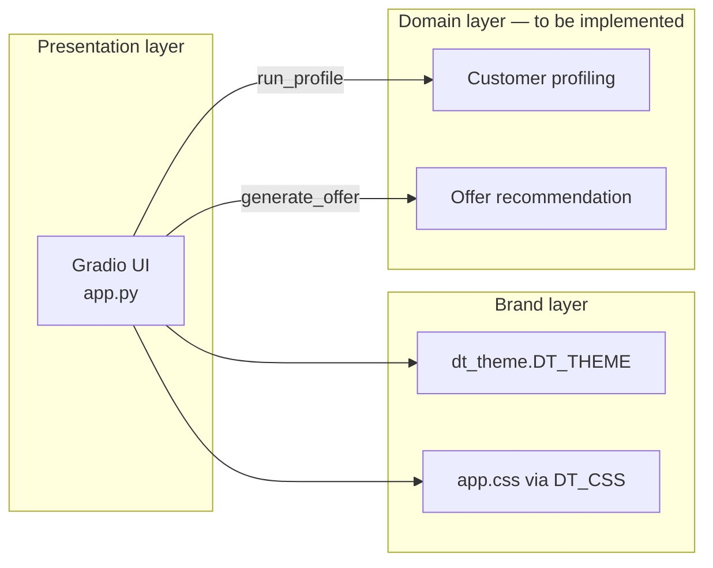

# Private Customer Profiler

**Telekom Mobile — usage-driven campaign intelligence (prototype UI)**

Interactive prototype for sales and marketing teams to explore how **usage features** and **behavioural trends** shape a private-customer profile and a downstream **tariff recommendation**. The application is a Gradio front end with Deutsche Telekom Magenta branding (light/dark). Segmentation and offer logic are deliberately stubbed so backend services can be integrated without redesigning the UI.

---

## Scope

| In scope (today) | Out of scope (planned integration) |
|------------------|----------------------------------|
| Manual capture of usage & trend signals via sliders | CRM / billing system of record |
| Profile templates for demo personas | Real-time CDR ingestion |
| Markdown profile snapshot | Production cluster / scoring models |
| Placeholder tariff & add-on suggestion | Product catalogue & eligibility rules |
| Telekom theme (Magenta `#E20074`, dark mode) | SSO, audit logging, PII handling |

**Status:** local development prototype. Not hardened for production (auth, data residency, observability).

---

## User workflow

1. **Profile template** — Optional preset (`Heavy data user`, `Voice-first business`) loads representative slider values. `— Custom —` leaves sliders unchanged.
2. **Usage features** — Adjust monthly usage dimensions.
3. **Trends** — Adjust trajectory indicators (see [Feature model](#feature-model)).
4. **Run profile** — Produces a customer snapshot (markdown table + trend summary).
5. **Generate offer** — Produces a suggested tariff and add-on (placeholder copy until rules/LLM is wired).

Default URL after launch: `http://127.0.0.1:7860` (Gradio assigns host/port; see terminal output).

---

## Feature model

Signals are split intentionally. This matches how campaign and pricing teams usually reason about customers.

### Usage features (level)

Static monthly usage — inputs to clustering / propensity in a full implementation.

| Key | UI label | Range | Default |
|-----|----------|-------|---------|
| `data_gb` | Monthly data (GB) | 0–150 | 30 |
| `voice_min` | Voice minutes | 0–3000 | 400 |
| `sms_count` | SMS count | 0–500 | 50 |
| `roaming_days` | Roaming days / month | 0–30 | 2 |

### Trends (trajectory)

Relative change indicators (−50 … +50). In the UI copy and placeholder logic, **trends annotate growth or decline; they do not drive cluster assignment**. When you connect a real model, document whether trends are features, post-hoc tags, or campaign triggers.

| Key | UI label | Default |
|-----|----------|---------|
| `data_trend` | Data trend | 5 |
| `voice_trend` | Voice trend | 0 |

Slider order in callbacks is fixed: `SLIDER_KEYS = usage keys + trend keys` (see `app.py`).

---

## Getting started

**Requirements:** Python 3.10+, network access for `pip` on first install.

```bash
git clone <repository-url>
cd telekom-personal-plan-recommender

python3 -m venv .venv
source .venv/bin/activate
python -m pip install --upgrade pip
pip install -r requirements.txt

python app.py
```

**Fedora:** if `python3 -m venv` fails, install `python3-venv` (`sudo dnf install python3-venv`).

**IDE:** set the interpreter to `.venv/bin/python` (Cursor / VS Code).

Use Gradio’s theme control in the UI footer to switch light/dark; styling follows Telekom tokens in both modes.

---

## Repository layout

```
telekom-personal-plan-recommender/
├── app.py              # UI composition, events, placeholder domain logic
├── assets/
│   └── telekom-logo.svg
├── styles/
│   ├── dt_theme.py     # Gradio Theme — Telekom palette (light + dark)
│   └── app.css         # Layout, header, subtitles, results typography
├── requirements.txt    # gradio>=6.14.0,<7
└── README.md
```

| Module | Responsibility |
|--------|----------------|
| `create_demo()` | Builds `gr.Blocks`, layout, `.change` / `.click` wiring |
| `load_profile()` | Template → slider values |
| `run_profile()` | Sliders → profile markdown (**replace with scoring service**) |
| `generate_offer()` | Profile text → offer markdown (**replace with rules / catalogue / LLM**) |
| `DT_THEME` / `DT_CSS` | Brand-compliant Gradio theme + CSS overrides |

---

## Architecture



**Current coupling:** `generate_offer` reads **markdown** from `profile_out`. For production, prefer `gr.State` or a typed DTO (segment ID, cluster label, feature vector) so you are not parsing UI output.

**Placeholder detection:** strings shown before a successful run start with `_` (`PLACEHOLDER_PREFIX`). Real profile output must not use that prefix or the offer step will refuse to run.

---

## UI structure & CSS hooks

Components use `elem_classes` for stable styling hooks:

| Class | Used on | Purpose |
|-------|---------|---------|
| `dt-header-row`, `dt-header-block` | Header row / HTML block | Full-width Magenta bar, logo, title |
| `dt-action-bar` | Template dropdown row | Top controls |
| `dt-feature-col` | Usage & trends columns | Column gap; aligns with action buttons |
| `dt-subtitle` | Section markdown | `h3` titles + helper text; respects `--body-text-color` in dark mode |
| `dt-btn-row` | Run / Generate row | Button alignment under feature columns |

Results sections use Gradio markdown: `## Results`, `### Profile`, `### Offer`. Level-2 headings use Magenta underline via `.prose h2`.

---

## Branding

Defined in `styles/dt_theme.py` and refined in `styles/app.css`.

| Token | Light | Dark |
|-------|-------|------|
| Accent (Magenta) | `#E20074` | `#E20074` / `#F48BBF` (links, secondary text) |
| Body background | `#FFFFFF` | `#191919` |
| Surfaces | `#F5F5F5` secondary | `#262626` blocks |
| Body text | `#191919` | `#F5F5F5` |

Production deployments must follow official **Deutsche Telekom brand guidelines** (logo usage, Magenta proportions, typography). Assets in `assets/` are for prototyping only.

---

## Profile templates

Configured in `PROFILES` (`app.py`). Each preset is a partial map of slider keys.

| Template | Typical use case |
|----------|------------------|
| — Custom — | Analyst-defined scenario |
| Heavy data user | High data, roaming, positive data trend |
| Voice-first business | Voice-heavy, low data, positive voice trend |

To add a template, extend `PROFILES` with a `dict[str, int]` keyed by `USAGE_SLIDERS` and `TREND_SLIDERS` keys.

---

## Integration guide

Recommended order when moving beyond the prototype:

1. **`run_profile()`** — Call segmentation API or batch model; return structured result + human-readable summary for `profile_out`.
2. **`generate_offer()`** — Input segment / scores; call product catalogue + eligibility; return compliant offer text (legal disclaimers, contract terms by channel).
3. **State** — Introduce `gr.State` for `ProfileResult` (dataclass or pydantic model) instead of passing markdown between steps.
4. **Templates** — Load presets from config (YAML/JSON) or CMDB rather than hard-coding in `app.py`.
5. **Dependencies** — Add packages to `requirements.txt` with explicit lower bounds; avoid unchecked `pip freeze` unless you pin a full lockfile intentionally.

Example launch options for shared environments:

```python
demo.launch(
    theme=DT_THEME,
    css=DT_CSS,
    server_name="0.0.0.0",  # only behind corporate reverse proxy / VPN
    auth=("user", "pass"),  # replace with SSO in production
)
```

---

## Operations & troubleshooting

| Symptom | Likely cause | Action |
|---------|--------------|--------|
| `ModuleNotFoundError: gradio` | venv not active | `source .venv/bin/activate` && `pip install -r requirements.txt` |
| Wrong packages / Python version | System Python used | `which python` → must be `.venv/bin/python` |
| Offer step always blocked | Profile not run or output starts with `_` | Run **Run profile** first; ensure real output does not use placeholder prefix |
| `venv` module missing (Fedora) | OS package absent | `sudo dnf install python3-venv` |

Do not run `sudo pip`. The `.venv` directory is git-ignored.

---

## Maintenance

- **Entry point:** `python app.py` → `main()` → `create_demo().launch(...)`.
- **Dependency policy:** single declared dependency `gradio` (6.14.x); upgrade minor versions after smoke-testing the UI.
- **Tests:** not yet present; add unit tests for `load_profile`, `run_profile`, and `generate_offer` before production wiring.

---

## Disclaimer

This repository is a **technical demonstrator** for Telekom Mobile campaign and profiling workflows. Logos and colours are for development. Production use requires security review, data-protection assessment, and approval under applicable Telekom software and brand standards.
