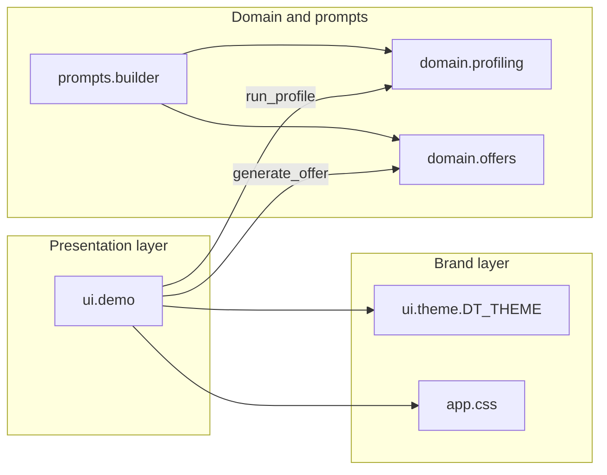

# Private Customer Profiler

**Telekom Mobile — usage-driven campaign intelligence (prototype UI)**

Interactive prototype for sales and marketing teams to explore how **usage features** and **behavioural trends** shape a private-customer profile and a downstream **tariff recommendation**. The application is a Gradio front end with Deutsche Telekom Magenta branding (light/dark). Segmentation and offer logic are deliberately stubbed so backend services can be integrated without redesigning the UI.

---

## Scope

| In scope (today) | Out of scope (planned integration) |
|------------------|----------------------------------|
| Manual capture of usage & trend signals via sliders | CRM / billing system of record |
| Profile templates for demo personas | Real-time CDR ingestion |
| Markdown profile snapshot | Production cluster / scoring models |
| LLM profile & offer (with rule-based fallback) | Live product catalogue API |
| Telekom theme (Magenta `#E20074`, dark mode) | SSO, audit logging, PII handling |

**Status:** local development prototype. Not hardened for production (auth, data residency, observability).

---

## User workflow

1. **Profile template** — Optional archetype preset (`Streamer`, `Chatterbox`, `Essential`, `Roamer`, `Messenger`) loads representative slider values. `— Custom —` leaves sliders unchanged.
2. **Usage features** — Adjust monthly usage dimensions.
3. **Trends** — Adjust trajectory indicators (see [Feature model](#feature-model)).
4. **Run profile** — Produces a customer snapshot (markdown table + trend summary).
5. **Generate offer** — Produces a suggested tariff and add-on via LLM or rule-based fallback.

Default URL after launch: `http://127.0.0.1:7860` (Gradio assigns host/port; see terminal output).

---

## Feature model

Signals are split intentionally. This matches how campaign and pricing teams usually reason about customers.

### Usage features (level)

Static monthly usage — inputs to clustering / propensity in a full implementation.

| Key | UI label | Range | Default |
|-----|----------|-------|---------|
| `data_gb` | Monthly data (GB) | 0–150 | 30 |
| `voice_min` | Voice minutes | 0–3000 | 400 |
| `sms_count` | SMS count | 0–500 | 50 |
| `roaming_days` | Roaming days / month | 0–30 | 2 |

### Trends (trajectory)

Relative change indicators (−50 … +50). In the UI copy and placeholder logic, **trends annotate growth or decline; they do not drive cluster assignment**. When you connect a real model, document whether trends are features, post-hoc tags, or campaign triggers.

| Key | UI label | Default |
|-----|----------|---------|
| `data_trend` | Data trend | 5 |
| `voice_trend` | Voice trend | 0 |

Slider order in callbacks is fixed: `SLIDER_KEYS = usage keys + trend keys` (see `telekom_profiler/config/sliders.py`).

---

## LLM (Ollama, local)

Profiles and offers are generated by a **local Ollama** model. No OpenAI API key required.

| Setting | Default | Purpose |
|---------|---------|---------|
| `OLLAMA_HOST` | `http://localhost:11434` | Ollama server URL |
| `OLLAMA_MODEL` | `llama3.2` | Model name (`ollama pull …`) |
| `OLLAMA_ENABLED` | `true` | Set `false` for rule-based fallback without Ollama |

**One-time setup:**

```bash
# Install Ollama: https://ollama.com
ollama serve          # if not already running as a service
ollama pull llama3.2  # or mistral, gemma2, etc. — match OLLAMA_MODEL in .env
```

Copy `.env.example` to `.env` and adjust `OLLAMA_MODEL` if needed.

**Common errors:** *connection refused* → start `ollama serve`; *model not found* → `ollama pull <model>`.

---

## Getting started

**Requirements:** Python 3.10+, network access for `pip` on first install.

```bash
git clone <repository-url>
cd telekom-personal-plan-recommender

python3 -m venv .venv
source .venv/bin/activate
python -m pip install --upgrade pip
pip install -r requirements.txt
cp .env.example .env   # optional: set OLLAMA_MODEL
# optional: editable install
pip install -e .

python app.py
# or: python -m telekom_profiler
```

**Fedora:** if `python3 -m venv` fails, install `python3-venv` (`sudo dnf install python3-venv`).

**IDE:** set the interpreter to `.venv/bin/python` (Cursor / VS Code).

Use Gradio’s theme control in the UI footer to switch light/dark; styling follows Telekom tokens in both modes.

---

## Repository layout

```
telekom-personal-plan-recommender/
├── app.py                      # Thin CLI entry (`python app.py`)
├── pyproject.toml              # Package metadata and console script
├── requirements.txt
├── telekom_profiler/           # Application package
│   ├── config/                 # Sliders, presets, UI messages
│   ├── domain/                 # Archetypes, rule-based profile & offer
│   ├── llm/                    # Ollama client
│   ├── services/               # LLM + fallback orchestration
│   ├── prompts/
│   │   ├── builder.py          # Fill LLM prompt templates
│   │   └── templates/          # run_profile.md, run_offer.md
│   ├── data/                   # Archetype + tariff reference (markdown)
│   ├── ui/
│   │   ├── demo.py             # Gradio layout and event handlers
│   │   └── theme/              # dt_theme.py, app.css
│   └── assets/                 # telekom-logo.svg
└── README.md
```

| Layer | Module | Responsibility |
|-------|--------|----------------|
| UI | `telekom_profiler.ui.demo` | `create_demo()`, Gradio wiring |
| Config | `telekom_profiler.config` | Sliders, `PROFILES`, placeholder copy |
| Domain | `telekom_profiler.domain` | Archetype scoring, profile & offer reports |
| Prompts | `telekom_profiler.prompts` | `build_profile_prompt`, `build_offer_prompt` |
| Theme | `telekom_profiler.ui.theme` | `DT_THEME`, `DT_CSS` |

---

## Architecture



**Current coupling:** `generate_offer` reads **markdown** from `profile_out`. For production, prefer `gr.State` or a typed DTO (segment ID, cluster label, feature vector) so you are not parsing UI output.

**Placeholder detection:** strings shown before a successful run start with `_` (`PLACEHOLDER_PREFIX`). Real profile output must not use that prefix or the offer step will refuse to run.

---

## UI structure & CSS hooks

Components use `elem_classes` for stable styling hooks:

| Class | Used on | Purpose |
|-------|---------|---------|
| `dt-header-row`, `dt-header-block` | Header row / HTML block | Full-width Magenta bar, logo, title |
| `dt-action-bar` | Template dropdown row | Top controls |
| `dt-feature-col` | Usage & trends columns | Column gap; aligns with action buttons |
| `dt-subtitle` | Section markdown | `h3` titles + helper text; respects `--body-text-color` in dark mode |
| `dt-btn-row` | Run / Generate row | Button alignment under feature columns |

Results sections use Gradio markdown: `## Results`, `### Profile`, `### Offer`. Level-2 headings use Magenta underline via `.prose h2`.

---

## Branding

Defined in `styles/dt_theme.py` and refined in `styles/app.css`.

| Token | Light | Dark |
|-------|-------|------|
| Accent (Magenta) | `#E20074` | `#E20074` / `#F48BBF` (links, secondary text) |
| Body background | `#FFFFFF` | `#191919` |
| Surfaces | `#F5F5F5` secondary | `#262626` blocks |
| Body text | `#191919` | `#F5F5F5` |

Production deployments must follow official **Deutsche Telekom brand guidelines** (logo usage, Magenta proportions, typography). Assets in `assets/` are for prototyping only.

---

## Profile templates

Configured in `PROFILES` (`telekom_profiler/config/sliders.py`). Each preset is a partial map of slider keys.

| Template | Usage (data / voice / SMS / roaming) | Trends (data / voice) |
|----------|--------------------------------------|------------------------|
| — Custom — | — | — |
| Streamer | 100 GB / 150 min / 20 / 3 days | +12 / −5 |
| Chatterbox | 12 GB / 2000 min / 80 / 2 days | −5 / +8 |
| Essential | 8 GB / 200 min / 30 / 1 day | 0 / 0 |
| Roamer | 35 GB / 400 min / 25 / 15 days | +5 / 0 |
| Messenger | 25 GB / 100 min / 200 / 1 day | +3 / −8 |

To add a template, extend `PROFILES` with a `dict[str, int]` keyed by `USAGE_SLIDERS` and `TREND_SLIDERS` keys.

---

## Integration guide

Recommended order when moving beyond the prototype:

1. **`render_profile_report()`** — Replace with an LLM call using `prompts.build_profile_prompt(data)`, or your segmentation API.
2. **`render_offer_report()`** — Replace with `prompts.build_offer_prompt(profile)` + catalog from `telekom_profiler/data/tariffs_private.md` (swap for live PCM/BSS).
3. **State** — Introduce `gr.State` for a typed `ProfileResult` instead of passing markdown between steps.
4. **Templates** — Load presets from YAML/JSON or CMDB; keep keys aligned with `config.sliders`.
5. **Dependencies** — Add packages to `requirements.txt` with explicit lower bounds; avoid unchecked `pip freeze` unless you pin a full lockfile intentionally.

Example launch options for shared environments:

```python
demo.launch(
    theme=DT_THEME,
    css=DT_CSS,
    server_name="0.0.0.0",  # only behind corporate reverse proxy / VPN
    auth=("user", "pass"),  # replace with SSO in production
)
```

---

## Operations & troubleshooting

| Symptom | Likely cause | Action |
|---------|--------------|--------|
| `ModuleNotFoundError: gradio` | venv not active | `source .venv/bin/activate` && `pip install -r requirements.txt` |
| Wrong packages / Python version | System Python used | `which python` → must be `.venv/bin/python` |
| Offer step always blocked | Profile not run or output starts with `_` | Run **Run profile** first; ensure real output does not use placeholder prefix |
| `venv` module missing (Fedora) | OS package absent | `sudo dnf install python3-venv` |

Do not run `sudo pip`. The `.venv` directory is git-ignored.

---

## Maintenance

- **Entry points:** `python app.py`, `python -m telekom_profiler`, or `telekom-profiler` after `pip install -e .`.
- **Dependency policy:** single declared dependency `gradio` (6.14.x); upgrade minor versions after smoke-testing the UI.
- **Sanity checks:** `python scripts/sanity_check.py` or `python -m unittest discover -s tests`

---

## Disclaimer

This repository is a **technical demonstrator** for Telekom Mobile campaign and profiling workflows. Logos and colours are for development. Production use requires security review, data-protection assessment, and approval under applicable Telekom software and brand standards.
