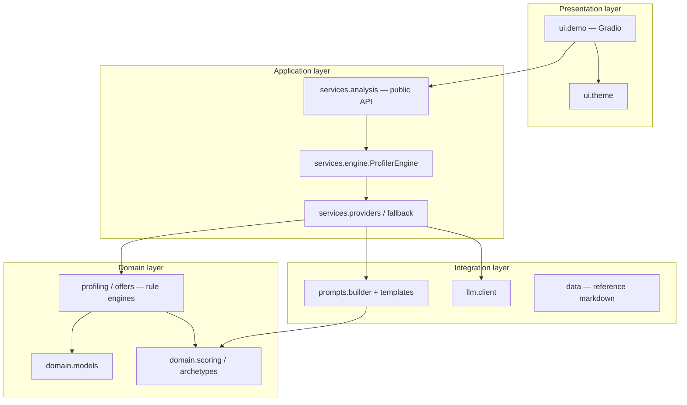
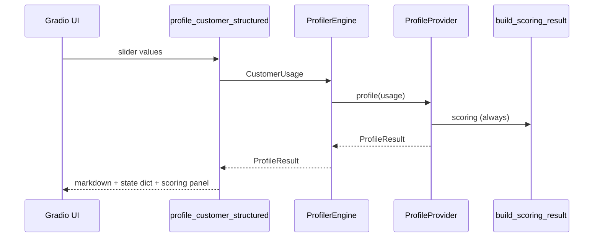

# Architecture

## 1. Purpose and scope

The Private Customer Profiler is an internal **presentation-layer application** for Telekom Mobile B2C use cases. It accepts a standardised usage snapshot, produces a customer profile, and recommends a tariff configuration.

The codebase is intentionally structured for **incremental industrialisation**: prototype rule engines and local Ollama inference can be replaced by enterprise services (segmentation platforms, PCM/BSS catalogues, approved model gateways) through well-defined extension points, without rewriting the Gradio front end.

This document describes the logical architecture, request flows, and scalability mechanisms. Deployment and security considerations are covered in [Deployment](deployment.md).

---

## 2. Architectural principles

| Principle | Implementation |
|-----------|----------------|
| Separation of concerns | Distinct packages for UI, orchestration, domain logic, and integration |
| Pluggable backends | `ProfileProvider` and `OfferProvider` protocols |
| Auditable segmentation | Deterministic `ScoringResult` computed in code for every profile |
| Stable contracts | `CustomerUsage` (input) and `ProfileResult` (profile output) |
| Configuration externalisation | Sliders, thresholds, and Ollama settings in `config/` |
| Fail-safe inference | Optional fallback from Ollama to rule-based providers |

Design rationale for deterministic scoring: [ADR 001](adr/001-scoring-in-code.md).

---

## 3. Layered structure

### Layer responsibilities

| Layer | Package | Owns |
|-------|---------|------|
| Presentation | `telekom_profiler.ui` | Layout, events, branding, `gr.State` session data |
| Application | `telekom_profiler.services` | Provider selection, orchestration, public API |
| Domain | `telekom_profiler.domain` | Business rules, archetype mathematics, typed models |
| Integration | `prompts`, `llm`, `data` | Prompt construction, HTTP client, static reference data |
| Configuration | `telekom_profiler.config` | Slider definitions, thresholds, environment bindings |

**Dependency rule:** Presentation and Application depend on Domain; Domain does not depend on UI or Gradio. Integration adapters are invoked from Application providers only.

---

## 4. Core components

### 4.1 ProfilerEngine

`ProfilerEngine` (`services/engine.py`) is the central orchestrator. It accepts `CustomerUsage` (or compatible mappings), delegates to injected providers, and returns `ProfileResult` or offer markdown.

- Default providers are selected via `default_profile_provider()` / `default_offer_provider()` based on environment flags.
- `get_engine()` exposes a process-wide singleton for the UI; `reset_engine()` rebuilds providers after configuration changes (used at startup and in tests).
- Custom deployments should prefer explicit `ProfilerEngine(...)` construction for testability and multi-tenant scenarios.

### 4.2 Provider model

| Protocol | Method | Output |
|----------|--------|--------|
| `ProfileProvider` | `profile(usage)` | `ProfileResult` |
| `OfferProvider` | `recommend(profile, usage)` | Offer markdown (`str`) |

Built-in implementations:

| Implementation | `source` tag | Use case |
|----------------|--------------|----------|
| `RuleBasedProfileProvider` | `rule_based` | Deterministic demo, CI, fallback |
| `OllamaProfileProvider` | `ollama` | Local LLM narrative |
| `FallbackProfileProvider` | `rule_based_fallback` | Ollama failure handling |
| `RuleBasedOfferProvider` | `rule_based` | Threshold-based catalogue |
| `OllamaOfferProvider` | `ollama` | LLM offer narrative |
| `FallbackOfferProvider` | (via rules) | Ollama failure handling |

### 4.3 Scoring pipeline

For every profile request—regardless of provider—`build_scoring_result()` computes:

- Ranked archetype distances (L1 on normalised usage)
- Primary and secondary archetype
- Overlay flags (trend and usage thresholds)
- Confidence label (`High` / `Medium` / `Low`)

This result is attached to `ProfileResult.scoring` and displayed in the UI independently of LLM-generated markdown.

---

## 5. Request flows

### 5.1 Profile generation

1. UI collects six slider values; values are clamped to configured bounds.  
2. `profile_customer_structured()` invokes `ProfilerEngine.profile()`.  
3. Active provider generates profile markdown (rules or Ollama).  
4. Scoring metadata is attached and persisted in `gr.State` for the offer step.

### 5.2 Offer generation

1. UI reads `ProfileResult` from session state (placeholder profiles are rejected).  
2. `ProfilerEngine.recommend()` invokes the active `OfferProvider`.  
3. Rule-based offers may use `profile.scoring` to bias tariff selection.  
4. Offer markdown is rendered in the results panel.

---

## 6. Extension points (scalability)

| Enterprise need | Extension mechanism | Typical owner |
|-----------------|---------------------|---------------|
| Corporate LLM gateway | New `ProfileProvider` / `OfferProvider` | AI platform team |
| Segmentation API | Replace or wrap `RuleBasedProfileProvider` | Data science / CRM |
| Live PCM catalogue | Custom `OfferProvider` + API client | Product / BSS |
| CRM-fed usage | Upstream builds `CustomerUsage` JSON | Integration team |
| Presets from CMDB | Externalise `PROFILES` (YAML/JSON loader) | Configuration management |
| Headless API | FastAPI layer over `ProfilerEngine` | Application team |
| Multi-brand | Per-tenant `ProfilerEngine(custom_providers)` | Platform team |

Detailed integration patterns: [Integration](integration.md).

---

## 7. Configuration and reference data

| Concern | Location |
|---------|----------|
| Slider bounds and UI copy | `config/sliders.py` |
| Overlay and offer thresholds | `config/thresholds.py` |
| Ollama and logging | `config/ollama_settings.py`, `.env` |
| Archetype narratives | `data/consumer_archetypes.md` |
| Tariff reference | `data/tariffs_private.md` |
| Prompt templates | `prompts/templates/*.md` |

Path resolution is centralised in `telekom_profiler.paths` to support packaging and testing.

---

## 8. Technology dependencies

| Dependency | Role in architecture |
|------------|---------------------|
| `gradio` | Presentation framework |
| `ollama` | HTTP client for local LLM (optional) |
| `python-dotenv` | Environment loading at startup |

No database, message broker, or external service is required for baseline operation.

---

## 9. Non-goals (current release)

The following are explicitly **not** implemented; plan via [Deployment](deployment.md) and [Integration](integration.md):

- Authentication and authorisation (SSO/RBAC)
- Horizontal autoscaling and health endpoints
- Centralised secret management
- PII encryption, retention policies, and audit trails
- Automated model evaluation and prompt governance pipelines

---

## 10. Related documents

- [Domain model](domain-model.md) — data definitions and archetype semantics  
- [Development](development.md) — engineering workflow  
- [API reference](api-reference.md) — public Python surface  
- [Configuration](configuration.md) — runtime settings  
