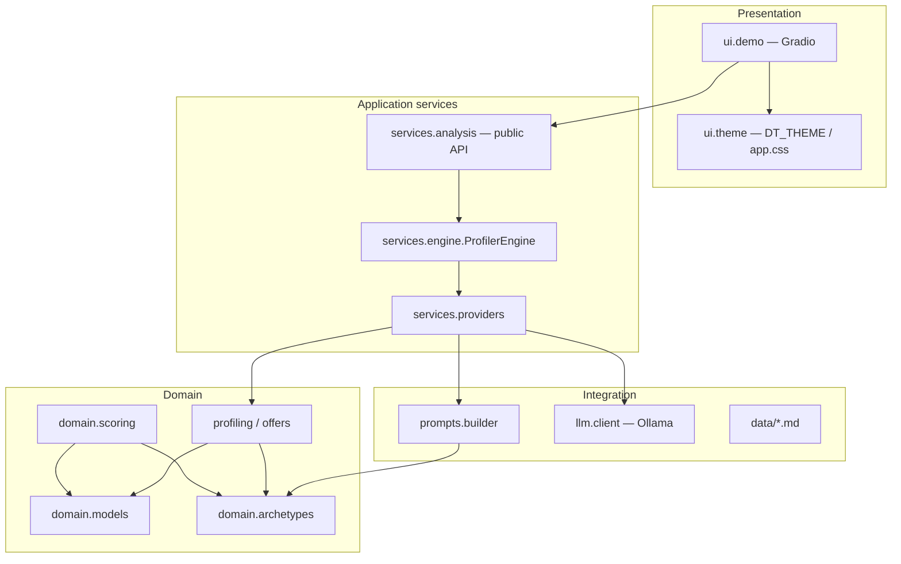

# Architecture

## Purpose

The Private Customer Profiler is a **presentation-layer prototype** for Telekom Mobile B2C teams. It captures usage and trend signals, produces a customer profile, and suggests a tariff—using either a **local Ollama LLM** or **deterministic rule engines**. The design separates concerns so production backends (segmentation, PCM, CRM) can replace stubs without rewriting the UI.

## Layered design



| Layer | Package | Responsibility |
|-------|---------|----------------|
| Presentation | `telekom_profiler.ui` | Gradio layout, events, Telekom branding |
| Application | `telekom_profiler.services` | Orchestration, provider selection, public API |
| Domain | `telekom_profiler.domain` | Business rules, archetype math, typed models |
| Integration | `telekom_profiler.prompts`, `llm`, `data` | Prompt assembly, Ollama, reference markdown |
| Configuration | `telekom_profiler.config` | Sliders, presets, Ollama env |

## Request flow

### Profile (`Run profile`)

1. UI collects six slider values → `dict[str, float]`.
2. `profile_customer(data)` → `ProfilerEngine.profile()`.
3. Engine selects `OllamaProfileProvider` or `RuleBasedProfileProvider` from `OLLAMA_ENABLED`.
4. **Scoring** always runs via `build_scoring_result()` (deterministic), even when the narrative is LLM-generated.
5. Markdown returned to `gr.Markdown` profile panel.

### Offer (`Generate offer`)

1. UI passes profile markdown + current sliders.
2. Placeholder guard: text starting with `_` is rejected (`PLACEHOLDER_PREFIX`).
3. `recommend_offer(profile, data)` → offer provider (Ollama or rules).
4. Markdown returned to offer panel.

## Extension points (scalability)

| Extension | Mechanism | Example |
|-----------|-----------|---------|
| New LLM backend | Implement `ProfileProvider` / `OfferProvider` | Azure OpenAI, internal gateway |
| Segmentation API | Replace `RuleBasedProfileProvider.profile()` | Call cluster service, map to markdown |
| Live catalogue | Replace tariff markdown in `data/tariffs_private.md` | PCM API client in `OllamaOfferProvider` |
| Typed UI state | Use `ProfileResult` + `gr.State` | Stop passing markdown between steps |
| Presets from CMDB | Load `PROFILES` from YAML/JSON | `config/presets_loader.py` (future) |
| Custom engine per tenant | `ProfilerEngine(custom_providers)` | Multi-brand deployments |

## Key design decisions

1. **Scoring is separate from narrative** — Archetype distances are computed in code and injected into prompts; the LLM is not the sole source of segment labels. This supports audit and A/B testing against model drift.
2. **Provider protocols** — `ProfileProvider` and `OfferProvider` allow swapping backends without changing `ui.demo`.
3. **Backward-compatible API** — `profile_customer()` / `recommend_offer()` return strings for the existing Gradio wiring; `profile_customer_structured()` exposes `ProfileResult` for new code.
4. **Single source for slider bounds** — `USAGE_SLIDERS` drives UI maxima and `normalize_usage()` in archetype scoring.

## Package layout

```
telekom_profiler/
├── config/           # sliders.py, ollama_settings.py
├── domain/           # models, archetypes, scoring, profiling, offers
├── services/         # engine, providers, protocols, analysis
├── prompts/          # builder + templates/
├── llm/              # Ollama client
├── data/             # Reference markdown (archetypes, tariffs)
├── ui/               # demo.py, theme/
├── paths.py          # Central path constants
└── assets/           # Brand SVG
```

## Dependencies

| Dependency | Role |
|------------|------|
| `gradio` | Web UI framework |
| `ollama` | Local LLM HTTP client |
| `python-dotenv` | Load `.env` for Ollama settings |

No database, message queue, or external API is required for the prototype.

## Non-goals (current release)

- Authentication / authorization
- PII encryption, retention policies
- Horizontal scaling, health endpoints
- Automated model evaluation pipelines

See [Deployment](deployment.md) and [Integration](integration.md) for production considerations.
