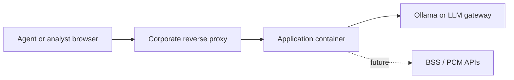

# Deployment guide

Target-state guidance for hosting the Private Customer Profiler in a Telekom Mobile-controlled environment. The repository ships a **development prototype**; this document does not constitute a certified production runbook.

---

## 1. Deployment status

| Aspect | Current prototype | Production target |
|--------|-------------------|-------------------|
| Maturity | Local / workshop use | Hardened internal service |
| Authentication | None | Corporate SSO (OIDC) |
| LLM | Local Ollama | Approved internal model gateway |
| Catalogue | Static markdown | Live PCM / BSS APIs |
| Secrets | `.env` file | Vault or platform secret store |
| Observability | Console logs | Centralised JSON logging, metrics |

---

## 2. Reference topology



| Component | Recommendation |
|-----------|----------------|
| UI | Gradio behind nginx or OpenShift HTTP route |
| LLM | Sidecar or shared cluster service; `OLLAMA_HOST` points to service DNS |
| Application | Stateless container; session in browser (`gr.State`) |
| Data plane | Egress allow-list to LLM and BSS endpoints only |

---

## 3. Container image (reference)

Not maintained in this repository; teams should derive from internal base images:

```dockerfile
FROM python:3.12-slim
WORKDIR /app
COPY requirements.txt pyproject.toml ./
COPY telekom_profiler ./telekom_profiler
COPY app.py README.md ./
RUN pip install --no-cache-dir -r requirements.txt && pip install .
ENV OLLAMA_ENABLED=false
EXPOSE 7860
CMD ["python", "-m", "telekom_profiler"]
```

| Practice | Rationale |
|----------|-----------|
| Multi-stage build | Smaller attack surface |
| Non-root user | Platform policy compliance |
| Pin dependency versions | Reproducible builds |
| `OLLAMA_ENABLED=false` in image default | Safe boot without LLM dependency |

Run Ollama as a separate deployment; configure `OLLAMA_HOST` to the internal service URL.

---

## 4. Security controls

| Control | Action |
|---------|--------|
| Transport | Terminate TLS at reverse proxy; no plain HTTP externally |
| Authentication | Integrate SSO; remove Gradio basic auth except for sandboxes |
| Gradio sharing | Disable `share=True` public tunnels |
| Data minimisation | No MSISDN or account identifiers in LLM prompts |
| Network policy | Restrict egress to approved LLM and BSS hosts |
| Supply chain | Scan images (Trivy, Clair, or corporate equivalent) |
| Secrets | Never commit `.env`; inject via secret store |

### 4.1 Data protection (GDPR)

Slider and API inputs may represent real subscriber usage when connected to production feeds. Treat as **personal data**:

- Define lawful basis and retention with legal / DPO  
- Avoid logging full profiles without retention limits  
- Complete DPIA before connecting to production CRM or billing  

---

## 5. Observability

| Signal | Suggested implementation |
|--------|--------------------------|
| Liveness | TCP or HTTP probe on Gradio port |
| Latency | Log duration of profile and offer operations; alert on p95 |
| LLM failures | Count `RuntimeError` from `llm.client`; track fallback rate |
| Provider mode | Structured log field `source` on `ProfileResult` |
| Trace correlation | Inject request ID at reverse proxy; pass in logs |

---

## 6. Scaling and availability

Gradio runs a single-process embedded server. For higher concurrency:

| Option | Trade-off |
|--------|-----------|
| Multiple replicas + sticky sessions | Minimal code change; session tied to instance |
| FastAPI (or similar) + `ProfilerEngine` | Headless API; separate front end |
| Async job queue for LLM steps | Better for batch campaigns |

Instant degradation path: set `OLLAMA_ENABLED=false` to rule-based providers without redeploying application logic.

---

## 7. Brand and compliance

Use approved Deutsche Telekom brand assets and Magenta guidelines for any customer-facing surface. Assets under `telekom_profiler/assets/` are for internal development only.

AI governance: align prompt templates and model selection with corporate model cards and approval workflows ([Integration](integration.md#prompt-and-catalogue-governance)).

---

## 8. Rollback and release management

- Pin `gradio`, `ollama`, and model versions in deployment manifests.  
- Tag container images with application version (`pyproject.toml`).  
- Maintain feature flag `OLLAMA_ENABLED` for rapid fallback.  
- Document rollback in the team’s standard change process.

---

## 9. Related documents

- [Configuration](configuration.md) — environment variables  
- [Ollama runbook](runbook-ollama.md) — LLM service operations  
- [Integration](integration.md) — BSS and CRM connection patterns  
- [Architecture](architecture.md) — component boundaries  
