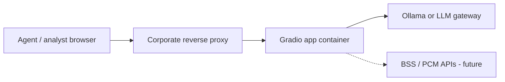

# Deployment guide

## Status

This repository is a **local development prototype**. The guidance below describes how a Telekom Mobile team would harden and deploy a derivative service—not a certified production runbook.

## Deployment topology (target)



| Component | Prototype | Production target |
|-----------|-----------|-------------------|
| UI | Gradio embedded server | Gradio behind nginx / OpenShift route |
| Auth | None | SSO (OIDC), VPN-only access |
| LLM | Local Ollama | Approved internal model gateway |
| Data | Static markdown | Live PCM + CRM APIs |
| Secrets | `.env` file | Vault / OpenShift secrets |
| Logs | Console | Central logging (JSON), trace IDs |

## Container sketch

Example `Dockerfile` pattern (not shipped in repo):

```dockerfile
FROM python:3.12-slim
WORKDIR /app
COPY requirements.txt pyproject.toml ./
COPY telekom_profiler ./telekom_profiler
COPY app.py README.md ./
RUN pip install --no-cache-dir -r requirements.txt && pip install .
ENV OLLAMA_ENABLED=false
EXPOSE 7860
CMD ["python", "-m", "telekom_profiler"]
```

Run Ollama as a **sidecar** or dedicated service; set `OLLAMA_HOST` to that service DNS name.

## Security checklist

- [ ] Disable public `share=True` Gradio links
- [ ] Enforce HTTPS at reverse proxy
- [ ] Replace basic auth with corporate SSO
- [ ] No customer PII in prompts sent to external LLMs without DPA
- [ ] Network policy: app → Ollama only; app → BSS via approved egress
- [ ] Scan container images (Trivy, Clair)
- [ ] Rotate API keys via secret store, not git

## Data protection

- Slider inputs may represent real customer usage if fed from production—treat as **personal data** under GDPR.
- Logs must not store full profiles without retention limits.
- LLM prompts should minimize identifiers (use segment IDs, not MSISDN).

## Observability (recommended)

| Signal | Implementation |
|--------|----------------|
| Health | HTTP `/health` wrapper or process probe on port 7860 |
| Latency | Log profile/offer duration; alert on p95 |
| LLM errors | Count `RuntimeError` from `llm.client` |
| Provider mode | Log `source` field on `ProfileResult` |

## Scaling

Gradio is single-process oriented. For many concurrent agents:

- Run multiple replicas behind a load balancer with sticky sessions, or
- Replace Gradio with a thin API (FastAPI) + separate front end, reusing `ProfilerEngine`.

## Brand compliance

Use official Telekom brand assets and Magenta guidelines for any customer-facing deployment. Prototype assets in `assets/` are for development only.

## Rollback

Pin `gradio`, `ollama`, and model versions in deployment manifests. Keep `OLLAMA_ENABLED=false` as a feature flag for instant fallback to rule-based mode.
